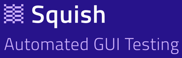

# GDMS-Final-Project

<p align="center">
    
</p>

## Overview

Our Team is with GDMS for ASU Capstone Project for GUI Test Process Development. This is our final submission repository, 
where we demonstrate the testing of a demo application on a virtual machine environment and subsequently deploy and test it on 
physical boards. The project focuses on automating GUI testing using tools like Squish and Qtqml apps.

## System Requirements

To run the application and tests successfully, ensure the following environment is set up:

- **OS**: Ubuntu 24.04
- **Qt**: 6.7.3 (with QML support)
- **Tesseract OCR**: 4.1.1
- **Python**: 3.12
- **Squish GUI Tester**: 8.0.0
> 💡 Note: Squish requires a valid license to run. See [Squish installation guide](https://www.froglogic.com/squish/) for details.

## Table of Contents

1. [Environment Setup](#environment-setup)
    * TODO (any other setup required)
    * [Tesseract](#ocr-prerequisites)
       * [OCR Setup FAQ](#ocr-environment-setup-faq)
2. Running Tests (TODO)
3. File/Folder Descriptions (TODO)
4. [Notes\/Resources](#notes)
   * [OCR Implementation](#ocr-implementation)

## Environment Setup

### Tesseract

Image and text recognition in Squish uses the open-source OCR engine **Tesseract**. As Tesseract is the primary OCR engine for Squish and includes all the necessary engine libraries and language files, it became the engine of choice for this project to prototype.

> 💡 Note: Other OCR engines may be configured for use in Squish. 

1. Requirements 
   - Display card that allows GPU acceleration (ex. Ubuntu on Xorg, x11)
       - Check current display server: 
       ```echo $XDG_SESSION_TYPE```
   - _tesseract-for-squish-4.1.1_ downloaded (See [here](https://doc.qt.io/squish/ocr-and-installing-tesseract-for-squish.html) for installation guide)

2. Installation
   1. Follow tesseract installation process. Make sure to enable **Register the Tesseract installation with Squish**.
   
   <p align="center">
       
   </p>
   
   2. Configure Tesseract OCR engine by clicking **Edit > Preferences** to open the Preferences window. Then in the side bar, **Squish > OCR > Tesseract** to ensure installation path with Squish. 
   3. Verify with test run. 

3. Test Run
   1. Record a test case the way you normally would using the Squish GUI
   2. Find **OCR Text** under the **Verify** tab 
   3. Select automatically detected text or configure your own **Search Text** Verification


#### OCR Environment Setup FAQ

1. Error: ```Squish desktop screenshot failed error``` when trying to implement OCR Verification.

    - This issue is due to incompatible display card/server. Depending on the Ubuntu version, the default display card may be **wayland**, which is incompatible with Squish OCR functions. 

2. When attempting to verify tesseract installation using **tesseract --version**, I get the following output:

    symbol lookup error: tesseract: undefined symbol: _ZN9tesseract16TessPAGERendererC1EPKc

    - This issue is caused by incompatible Leptonica and Tesseract downloads, or multiple Tesseract versions installed in the system. Clear Tesseract and all related libraries and reinstall.

3. Error: ``` Failed retrieving the engine properties: Cannot find the Leptonica library ```
    - If encountering Leptonica library issues, verify Squish path and, if applicable, change the default **lib64** folder to **lib** as listed in the tesseract download.

## Running Tests

## File/Folder Descriptions

```
├── README.md
├── sampleApp/
│   ├── Build files (CMake)
│   ├── Source code (.qml, .cpp)
│   ├── assets/
├── automate_tests_script.sh
├── test_script_README.md
└── testSuites
    ├── README.md
    ├── readmeMedia/
    ├── suite_contactScreenTableTest/
    │   ├── tst_/
    │   ├── tst_case1/
    │   └── tst_case_table/
    ├── suite_imageBasedTesting/
    │   ├── screenshots/
    │   ├── shared/
    │   │   ├── searchImages/
    │   ├── tst_example/
    │   ├── tst_iconRecognition/
    │   ├── tst_logging/
    │   └── tst_textRecognition/
    ├── suite_lockscreenTesting/
    │   ├── tst_lockscreen_keyboard_input/
    │   └── tst_lockscreen_modal/
    ├── suite_phoneScreen/
    │   ├── tst_findIndexOfElementContainingString/
    │   └── tst_verifyOnAndOffScreenProperties/
    └── suite_settingsScreen/
        ├── tst_doubleClick/
        ├── tst_longPress/
        └── tst_sliders/
```

**GDMS-Final-Project/**
* **README.md** – Overview and setup instructions for the project  
* **SettingsSuiteResults.txt** – Exampled logging from scripting  
* **sampleApp/**  
   * Application source code (**ContactsScreen.qml**, **HistoryScreen.qml**, **main.cpp**, **images.qrc**, etc.)  
   * Assets and images for UI elements, including OCR testing resources  
   * CMake build files (**CMakeLists.txt**)  
* **script.sh** – Shell script used to example automation tasks  
* **testSuites/** – Automated test suites organized by feature (Contact screen, Lock screen, etc.) with shared Python scripts and test assets like screenshots and image references  
* **readmeMedia/** – Assets for **README.md** files for individual test suites  
* **suite_contactScreenTableTest/** – Test suite focused on table verification points  
* **suite_imageBasedTesting/** – Test suite focused on OCR applications for secure systems. Includes templates (**tst_iconRecognition**, **tst_textRecognition**, **tst_logging**) and example file (**tst_example**)  
   * **screenshots/** – Directory for example screenshot piping in **test_example.py** file.  
   * **shared/searchImages/** – When utilizing the integrated OCR engine in Squish, referenced images to search are stored here.  
* **suite_lockscreenTesting/** – Test suite focused on user input  
* **suite_phoneScreen/** – Test suite focused on list verification  
* **suite_settingsScreen/** – Test suite focused on general GUI inputs  


## Notes

### OCR Implementation

#### Creating Test Cases

The simplest way developers can begin creating their image-based verification test suites is by getting familiar with Squish's APIs for image and text verification using the GUI:

#### Useful APIs and functions

1. [test.ImagePresent()](https://doc.qt.io/squish/test-imagepresent-function.html#test-imagepresent-function): Basic Squish API to search for image on current screen 
2. [test.ocrTextPresent()](https://doc.qt.io/squish/test-ocrtextpresent-function.html): Basic Squish API to scan current screen for instances of a given string

See [this page](https://doc.qt.io/squish/squish-api.html) to find a more comprehensive list of functions to use in this process.

#### Adding Images
These images will be the source of reference while creating your test cases. After adding all of your images to a relative folder in the test suite, you will be able to select these images as pre-configure images when creating test cases using Squish's recording GUI. Additionally, when utilizing the test.ImagePresent function, the image file names will pre-populate for ease of use. 


1. Option 1: Add images to locate during test case recording:
2. Option 2: If you have .pngs or comparable files already stored in your filesystem, you can speed up the image verification process by adding those images to the shared testSuite folder in your project. 
    * For example, in this project, you would add the icons to verify in: _GDMS-Final-Project/testSuites/suite_imageBasedTesting/shared/searchImages/<image-name.png>_ and use _image-name_ in the test.imagePresent() API. 

## Resources:

* [Squish: Installing Tesseract](https://doc.qt.io/squish/ocr-and-installing-tesseract-for-squish.html)
* [Squish: Image-based-testing example](https://doc.qt.io/squish/how-to-do-image-based-testing.html)
* [Tesseract: official repository](https://github.com/tesseract-ocr/tesseract)
* [Qt: Tesseract limitations](https://qatools.knowledgebase.qt.io/squish/integrations/ocr-engines/ocr-limitations/)
* [Squish: APIs](https://doc.qt.io/squish/squish-api.html)

