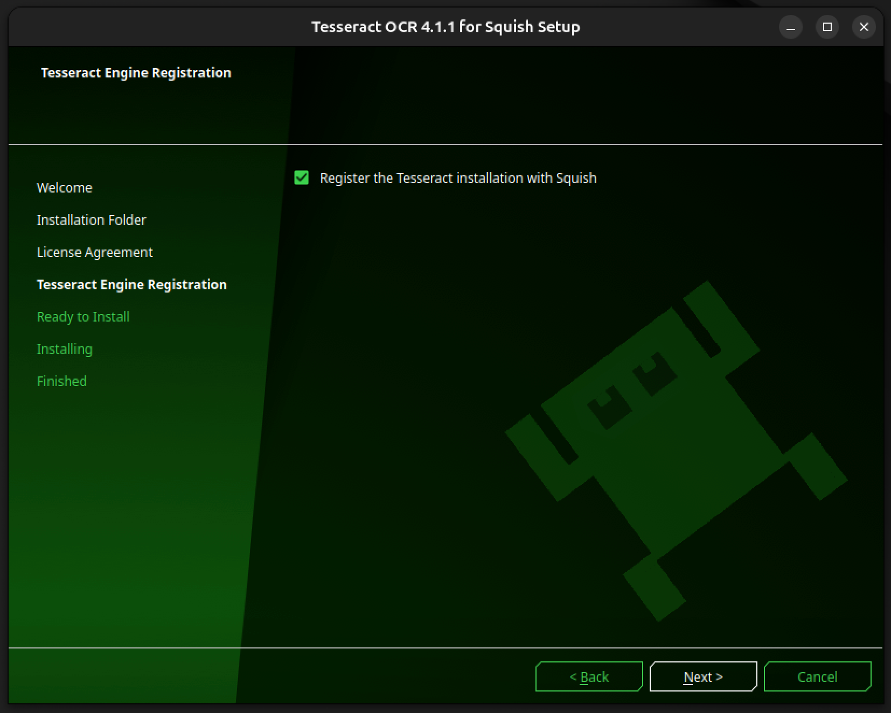

# OCR (Image-based) Testing 
Image and text recognition in Squish uses the open-source OCR engine **Tesseract**. As Tesseract is the primary OCR engine for Squish and includes all the necessary engine libraries and language files, it became the engine of choice for this project to prototype. 

**NOTE: Other OCR engines may be configured for use in Squish. 

## Table of Contents

1. [Environment Setup (Ubuntu 24.04)](#environment-setup)
    * [Prerequisites](#prerequisites)
    * [Installation](#installing-tesseract)
    * [Setup FAQ](#environment-setup-faq)
2. [Creating Tests](#creating-test-cases)
    * [Useful OCR and Image APIs](#useful-apis)
    * [Adding reference images](#adding-images)
3. [Examples and Templates](#template--example-test)
<!-- 3. Error Logging -->

5. [Notes\/Resources](#notes)


## Environment Setup

### Prerequisites

- Display card that allows GPU accelleration (ex. Ubuntu on Xorg, x11)
    - Check current display server: 
    ```echo $XDG_SESSION_TYPE```

- _tesseract-for-squish-4.1.1_ download (See [here](https://doc.qt.io/squish/ocr-and-installing-tesseract-for-squish.html) for  downlaod)

### Installing Tesseract

1. Follow tesseract installation process. Make sure to enable **Register the Tesseract installation with Squish**.

<p align="center">
    
</p>

2. Configure Tesseract OCR engine by clicking **Edit > Preferences** to open the Preferences window. Then in the side bar, **Squish > OCR > Tesseract** to ensure installation path with Squish. 
3. Verify with test run. 

### Running Tesseract


1. Record a test case the way you normally would using the Squish GUI
2. Find **OCR Text** under the **Verify** tab 
3. Select automatically detected text or configure your own **Search Text** Verification

### Environment Setup FAQ

1. Error: ```Squish desktop screenshot failed error``` when trying to implement OCR Verification.

    - This issue is due to incompatible display card/server. Depending on the Ubuntu version, the default display card may be **wayland**, which is incompatible with Squish OCR functions. 

2. When attempting to verify tesseract installation using **tesseract --version**, I get the following output:

    symbol lookup error: tesseract: undefined symbol: _ZN9tesseract16TessPAGERendererC1EPKc

    - This issue is caused by incompatible Leptonica and Tesseract downloads, or multiple Tesseract versions installed in the system. Clear Tesseract and all related libraries and reinstall.

3. Error: ``` Failed retrieving the engine properties: Cannot find the Leptonica library ```
    - If encountering Leptonica library issues, verify Squish path and, if applicable, change the default **lib64** folder to **lib** as listed in the tesseract download.


## Creating Test Cases

### Introduction
The simplest way developers can begin creating their image-based verification test suites is by getting familiar with Squish's APIs for image and text verification using the GUI:

### Useful APIs and functions

1. [test.ImagePresent()](https://doc.qt.io/squish/test-imagepresent-function.html#test-imagepresent-function): Basic Squish API to search for image on current screen 
2. [test.ocrTextPresent()](https://doc.qt.io/squish/test-ocrtextpresent-function.html): Basic Squish API to scan current screen for instances of a given string

See [this page](https://doc.qt.io/squish/squish-api.html) to find a more comprehensive list of functions to use in this process.

### Adding Images
These images will be the source of reference while creating your test cases. After adding all of your images to a relative folder in the test suite, you will be able to select these images as pre-configure images when creating test cases using Squish's recording GUI. Additionally, when utilizing the test.ImagePresent function, the image file names will pre-populate for ease of use. 


1. Option 1: Add images to locate during test case recording:
2. Option 2: If you have .pngs or comparable files already stored in your filesystem, you can speed up the image verification process by adding those images to the shared testSuite folder in your project. 
    * For example, in this project, you would add the icons to verify in: _GDMS-Final-Project/testSuites/suite_imageBasedTesting/shared/searchImages/<image-name.png>_ and use _image-name_ in the test.imagePresent() API. 

## Template & Example Test
The templates provided in the respective testSuite include examples of 

1. Full test case example
2. Region Testing
3. Error logging

<!-- ## Error Logging

### Screenshots upon test pass/fail

### Verbosity -->

## Notes

### Tesseract OCR Engine Difficulties

While going through the process of research and tinkering with the OCR engine, there's been some known faults. Further exploration and engine tuning to resolve these issues may be required. These issues include:

#### Recognizing Text
1. Has difficulty recognizing ligatures.
2. Is not able to recognize the "^" character. It will be recognized as the "%" character.
3. Full width numbers are able to be recognized, but too many in a single row results in required seperation testing.  
4. 0 Will be recognized as uppercase O, unless surrounded by other digits. LSTM mode does not help in the base engine.
5. Single Block Segmentation can be used to combine paragraph text, but more often than not text is still best recognized row-by-row.


### Resources:

* [Squish: Installing Tesseract](https://doc.qt.io/squish/ocr-and-installing-tesseract-for-squish.html)
* [Squish: Image-based-testing example](https://doc.qt.io/squish/how-to-do-image-based-testing.html)
* [Tesseract: official repository](https://github.com/tesseract-ocr/tesseract)
* [Qt: Tesseract limitations](https://qatools.knowledgebase.qt.io/squish/integrations/ocr-engines/ocr-limitations/)
* [Squish: APIs](https://doc.qt.io/squish/squish-api.html)

